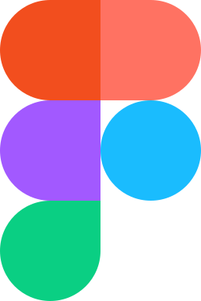

# Portfolio

---

A web application designed in Figma and built with Angular. It serves as a showcase of my skills, interests, and projects. Supporting both Polish and English languages, it ensures accessibility for a broader audience. To enhance the user experience, I implemented Angular's animation module. Additionally, I utilize NgRx to facilitate smoother communication between components and the application state. The application underwent testing using Jasmine with Karma to ensure functionality and reliability.

##### Technologies I used:

  &nbsp;
  &nbsp;
  &nbsp;
  &nbsp;
  &nbsp;
  &nbsp;
  &nbsp;
  &nbsp;
  &nbsp;
  &nbsp;

